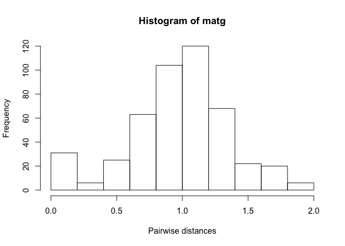
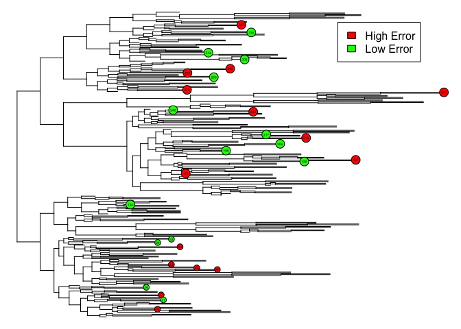
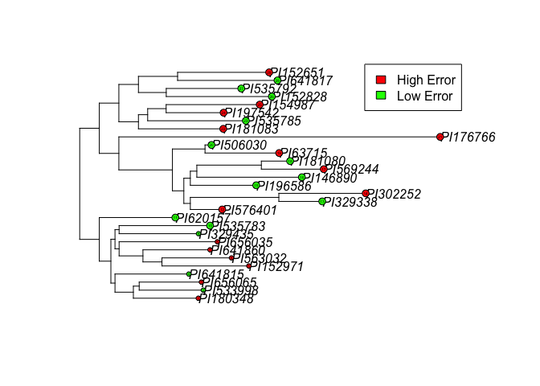

Phylogenetic Tree
================
Ishita Debnath
2/15/2021

``` r
library(phytools)
```

    ## Warning: package 'phytools' was built under R version 3.6.2

    ## Loading required package: ape

    ## Warning: package 'ape' was built under R version 3.6.2

    ## Loading required package: maps

``` r
library(ggtree)
```

    ## Warning: package 'ggtree' was built under R version 3.6.3

    ## Registered S3 method overwritten by 'treeio':
    ##   method     from
    ##   root.phylo ape

    ## ggtree v2.0.4  For help: https://yulab-smu.github.io/treedata-book/
    ## 
    ## If you use ggtree in published research, please cite the most appropriate paper(s):
    ## 
    ## - Guangchuang Yu, Tommy Tsan-Yuk Lam, Huachen Zhu, Yi Guan. Two methods for mapping and visualizing associated data on phylogeny using ggtree. Molecular Biology and Evolution 2018, 35(12):3041-3043. doi: 10.1093/molbev/msy194
    ## - Guangchuang Yu, David Smith, Huachen Zhu, Yi Guan, Tommy Tsan-Yuk Lam. ggtree: an R package for visualization and annotation of phylogenetic trees with their covariates and other associated data. Methods in Ecology and Evolution 2017, 8(1):28-36, doi:10.1111/2041-210X.12628

    ## 
    ## Attaching package: 'ggtree'

    ## The following object is masked from 'package:ape':
    ## 
    ##     rotate

``` r
library(ape)
library(adephylo)
```

    ## Loading required package: ade4

    ## Warning: package 'ade4' was built under R version 3.6.2

    ## Registered S3 method overwritten by 'spdep':
    ##   method   from
    ##   plot.mst ape

## Creating a matrix of patristic distances between the cultivars

The cultivars were chosen based on our machin learning model results.

``` r
phy<-read.tree("/Users/ishitadebnath/Desktop/Genomics/tree.txt")
index<-read.table("/Users/ishitadebnath/Desktop/Genomics/index.txt", header = F)
index$V1<-as.character(index$V1)
index$V2<-as.character(index$V2)

phy$tip.label<-index[[2]][match(phy$tip.label, index[[1]])]
w<-c("PI569244" , "PI302252", "PI152651", "PI152971", "PI63715", "PI576401", "PI641860", "PI181083", "PI180348","PI563032", "PI656065","PI154987", "PI197542","PI656035","PI176766",
"PI181080" , "PI196586", "PI620157", "PI535792", "PI329435", "PI533998","PI152828", "PI506030", "PI535785","PI535783", "PI641817","PI506030", "PI641815", "PI329338", "PI146890")

matg<-matrix(NA, nrow = length(w), ncol = length(w), dimnames = list(w))
colnames(matg) <- w
for (i in 1:length(w)){
a=w[i]
for (j in 1:length(w)){
b=w[j]
matg[i,j]=cophenetic.phylo(phy)[a,b]
}
}
```

## Distribution of the patristic distance

``` r
matg[lower.tri(matg)] <- NA
hist(matg, xlab = "Pairwise distances")
```

<!-- -->

``` r
summary(matg)
```

    ##     PI569244     PI302252         PI152651         PI152971     
    ##  Min.   :0    Min.   :0.0000   Min.   :0.0000   Min.   :0.0000  
    ##  1st Qu.:0    1st Qu.:0.2823   1st Qu.:0.6917   1st Qu.:0.9434  
    ##  Median :0    Median :0.5645   Median :1.3835   Median :1.3537  
    ##  Mean   :0    Mean   :0.5645   Mean   :0.9714   Mean   :1.0760  
    ##  3rd Qu.:0    3rd Qu.:0.8468   3rd Qu.:1.4570   3rd Qu.:1.4863  
    ##  Max.   :0    Max.   :1.1290   Max.   :1.5306   Max.   :1.5966  
    ##  NA's   :29   NA's   :28       NA's   :27       NA's   :26      
    ##     PI63715          PI576401         PI641860         PI181083     
    ##  Min.   :0.0000   Min.   :0.0000   Min.   :0.0000   Min.   :0.0000  
    ##  1st Qu.:0.9054   1st Qu.:0.5682   1st Qu.:0.7819   1st Qu.:0.8866  
    ##  Median :1.0525   Median :0.6763   Median :1.1218   Median :1.0133  
    ##  Mean   :0.8955   Mean   :0.6703   Mean   :0.9452   Mean   :0.9344  
    ##  3rd Qu.:1.2269   3rd Qu.:0.9521   3rd Qu.:1.2351   3rd Qu.:1.1282  
    ##  Max.   :1.2929   Max.   :1.0932   Max.   :1.4605   Max.   :1.3696  
    ##  NA's   :25       NA's   :24       NA's   :23       NA's   :22      
    ##     PI180348         PI563032         PI656065         PI154987    
    ##  Min.   :0.0000   Min.   :0.0000   Min.   :0.0000   Min.   :0.000  
    ##  1st Qu.:0.7905   1st Qu.:0.5938   1st Qu.:0.7028   1st Qu.:1.015  
    ##  Median :0.9196   Median :1.0341   Median :0.9267   Median :1.074  
    ##  Mean   :0.9076   Mean   :0.9245   Mean   :0.8601   Mean   :1.030  
    ##  3rd Qu.:1.1156   3rd Qu.:1.2232   3rd Qu.:1.1089   3rd Qu.:1.202  
    ##  Max.   :1.4194   Max.   :1.5357   Max.   :1.4302   Max.   :1.498  
    ##  NA's   :21       NA's   :20       NA's   :19       NA's   :18     
    ##     PI197542         PI656035         PI176766        PI181080     
    ##  Min.   :0.0000   Min.   :0.0000   Min.   :0.000   Min.   :0.0000  
    ##  1st Qu.:0.8673   1st Qu.:0.7029   1st Qu.:1.656   1st Qu.:0.9551  
    ##  Median :0.9316   Median :0.9846   Median :1.722   Median :1.1596  
    ##  Mean   :0.8846   Mean   :0.9142   Mean   :1.622   Mean   :1.0250  
    ##  3rd Qu.:1.0671   3rd Qu.:1.1392   3rd Qu.:1.794   3rd Qu.:1.2407  
    ##  Max.   :1.3708   Max.   :1.4862   Max.   :1.993   Max.   :1.7281  
    ##  NA's   :17       NA's   :16       NA's   :15      NA's   :14      
    ##     PI196586         PI620157         PI535792        PI329435     
    ##  Min.   :0.0000   Min.   :0.0000   Min.   :0.000   Min.   :0.0000  
    ##  1st Qu.:0.6993   1st Qu.:0.6934   1st Qu.:0.913   1st Qu.:0.6455  
    ##  Median :1.0353   Median :0.8397   Median :1.024   Median :0.9209  
    ##  Mean   :0.9232   Mean   :0.8764   Mean   :1.012   Mean   :0.9074  
    ##  3rd Qu.:1.1134   3rd Qu.:1.0264   3rd Qu.:1.145   3rd Qu.:1.0900  
    ##  Max.   :1.6091   Max.   :1.6001   Max.   :1.694   Max.   :1.6813  
    ##  NA's   :13       NA's   :12       NA's   :11      NA's   :10      
    ##     PI533998         PI152828        PI506030         PI535785     
    ##  Min.   :0.0000   Min.   :0.000   Min.   :0.0000   Min.   :0.0000  
    ##  1st Qu.:0.6720   1st Qu.:1.015   1st Qu.:0.7330   1st Qu.:0.9158  
    ##  Median :0.9371   Median :1.104   Median :0.8790   Median :1.0046  
    ##  Mean   :0.8981   Mean   :1.091   Mean   :0.7940   Mean   :0.9959  
    ##  3rd Qu.:1.0982   3rd Qu.:1.229   3rd Qu.:0.9508   3rd Qu.:1.1227  
    ##  Max.   :1.6982   Max.   :1.801   Max.   :1.4522   Max.   :1.7101  
    ##  NA's   :9        NA's   :8       NA's   :7        NA's   :6       
    ##     PI535783         PI641817        PI506030         PI641815     
    ##  Min.   :0.0000   Min.   :0.000   Min.   :0.0000   Min.   :0.0000  
    ##  1st Qu.:0.6722   1st Qu.:1.006   1st Qu.:0.7330   1st Qu.:0.6214  
    ##  Median :0.9609   Median :1.116   Median :0.8892   Median :0.8845  
    ##  Mean   :0.9312   Mean   :1.095   Mean   :0.7818   Mean   :0.8615  
    ##  3rd Qu.:1.1219   3rd Qu.:1.214   3rd Qu.:0.9508   3rd Qu.:1.0498  
    ##  Max.   :1.7219   Max.   :1.821   Max.   :1.4522   Max.   :1.6474  
    ##  NA's   :5        NA's   :4       NA's   :3        NA's   :2       
    ##     PI329338         PI146890     
    ##  Min.   :0.0000   Min.   :0.0000  
    ##  1st Qu.:0.9002   1st Qu.:0.8464  
    ##  Median :1.2677   Median :1.1957  
    ##  Mean   :1.1207   Mean   :1.0627  
    ##  3rd Qu.:1.3338   3rd Qu.:1.2559  
    ##  Max.   :1.8409   Max.   :1.7693  
    ##  NA's   :1

## Plotting the phylogenetic tree

``` r
plot(phy, show.tip.label = FALSE,no.margin=TRUE)
tiplabels(frame="circle",bg="red",cex=.3, tip=which(phy$tip.label%in% c( "PI569244" , "PI302252", "PI152651", "PI152971", "PI63715", "PI576401", "PI641860", "PI181083", "PI180348","PI563032", "PI656065","PI154987", "PI197542","PI656035","PI176766")))
tiplabels(frame="circle",bg="green",cex=.3, tip=which(phy$tip.label%in% c( "PI181080" , "PI196586", "PI620157", "PI535792", "PI329435", "PI533998","PI152828", "PI506030", "PI535785","PI535783", "PI641817","PI506030", "PI641815", "PI329338", "PI146890")))
legend(0.95, 350, legend=c("High Error", "Low Error"),
       fill=c("red", "green"), xpd = T, cex = 1)
```

<!-- -->

## Pruning the tree

``` r
mod<-keep.tip(phy, w)
plot(mod)
tiplabels(frame="circle",bg="red",cex=.3, tip=which(mod$tip.label%in% c( "PI569244" , "PI302252", "PI152651", "PI152971", "PI63715", "PI576401", "PI641860", "PI181083", "PI180348","PI563032", "PI656065","PI154987", "PI197542","PI656035","PI176766")))
tiplabels(frame="circle",bg="green",cex=.3, tip=which(mod$tip.label%in% c( "PI181080" , "PI196586", "PI620157", "PI535792", "PI329435", "PI533998","PI152828", "PI506030", "PI535785","PI535783", "PI641817","PI506030", "PI641815", "PI329338", "PI146890")))
legend(1, 30, legend=c("High Error", "Low Error"),
       fill=c("red", "green"), xpd = T, cex = 1)
```

<!-- -->
